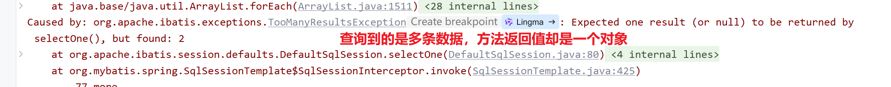
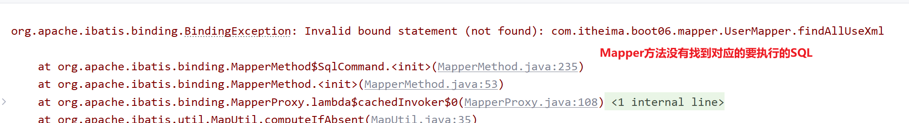
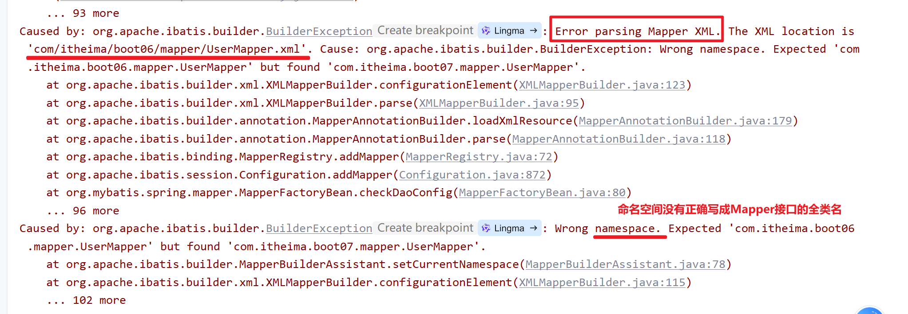
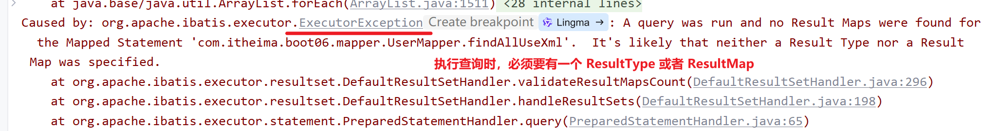
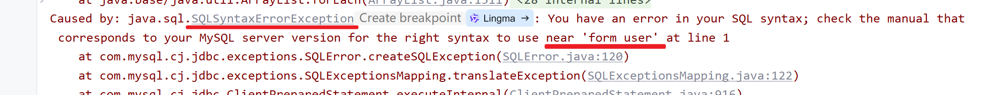

本文记录MyBatis的一些Bug和部分解决措施.

<!-- more -->
# Expected one result (or null) to be returned by selectOne(), but found: 2
## 问题描述
在使用MyBatis的`selectOne()`方法时,期望返回一个结果或null,但实际上返回了两个结果,导致抛出异常.

## 解决方法
实际上是方法返回了多条数据,并没有用集合等对象去存储.只要把方法逻辑改为将查询结果存储到List等集合中即可.

# BindException: Invalid bound statement (not found): xxx
## 问题描述
没有找到与xxx匹配的SQL语句

## 解决方法
这是基于Xml文件注入SQL语句才会产生的问题,需注意是否写与mapper中的方法同名的Xml文件.

# Error parsing Mapper XML. The Xml location is '.../xxx/xml'. Cause: org.apache.ibatis.builder.BuilderException: Wrong namespace. Excepted 'aMapper', but found 'bMapper'
## 问题描述
Mapper XML文件的namespace与Mapper接口不匹配.

## 解决方法
检查Mapper XML文件的namespace是否与Mapper接口的名称一致,有可能是没写全类名,也就是要把包名也写全.

# ExecutorException: A query was run and no Result Maps were found for the Mapped Statement 'xxx'. It's likely that neither a Result Type nor a Result Map was specified.
## 问题描述
Mapper XML文件中没有配置Result Type或Result Map.

## 解决方法
执行查询语句一定要有返回值去接收查询结果,所以检查Mapper XML文件,确保配置Result Type或Result Map.

# SQLSyntaxErrorException: You have an error in your SQL syntax; check the manual that corresponds to your MySQL server version for the right syntax to use near 'xxx' at line 1
## 问题描述
SQL语句语法错误.

## 解决方法
检查SQL语句,确保语法正确.
