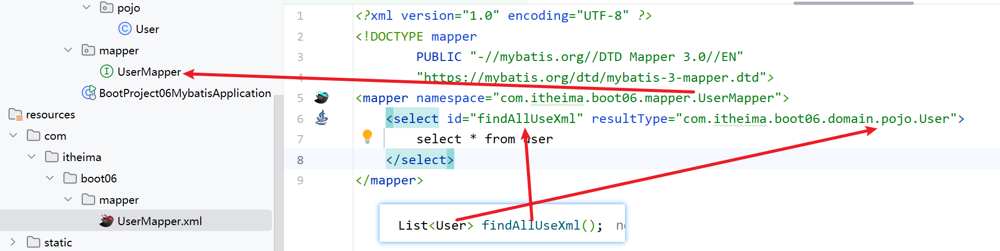

MyBatis是一款优秀的持久层框架,用于简化JDBC的开发.
本文及后续JavaWeb所创建的项目均为Maven+SpringBoot项目,用的是Aliyun的Maven仓库.
主要记录MyBatis依赖的安装过程和入门操作.

<!-- more -->
# MyBatis的安装
## 导入MyBatis依赖和MySQL驱动
```xml
<dependency>
    <groupId>org.mybatis.spring.boot</groupId>
    <artifactId>mybatis-spring-boot-starter</artifactId>
    <version>3.0.3</version>
</dependency>
<dependency>
    <groupId>com.mysql</groupId>
    <artifactId>mysql-connector-j</artifactId>
    <scope>runtime</scope>
</dependency>
<dependency>
    <groupId>org.projectlombok</groupId>
    <artifactId>lombok</artifactId>
</dependency>
```
## 项目结构
项目结构如下:
```
MyBatisDemo
├── src
│   ├── main
│   │   ├── java
│   │   │   └── com
│   │   │       └── example
│   │   │           └── mybatisdemo
│   │   │               ├── domain
│   │   │               │    └── pojo
│   │   │               │         └──User.java
│   │   │               ├── mapper
│   │   │               │   └── UserMapper.java
│   │   │               └── MyBatisDemoApplication.java
│   │   ├── test
│   │   │   └── java
│   │   │       └── com
│   │   │           └── example
│   │   │               └── mybatisdemo
│   │   │                   └── MyBatisDemoApplicationTests.java
│   │   └── resources
│   │       └── application.properties
```

## 项目配置
在application.properties中配置数据库连接信息.
```properties
#数据库访问的url地址
spring.datasource.url=jdbc:mysql://localhost:3306/databaseName
#数据库驱动类类名
spring.datasource.driver-class-name=com.mysql.cj.jdbc.Driver
#访问数据库-用户名
spring.datasource.username=root
#访问数据库-密码
spring.datasource.password=pass
```

# MyBatis的初编码
## 编写Mapper接口
在src/main/java/com/example/mybatisdemo/mapper目录下创建UserMapper.
持久层接口定义SQL语句.
java文件.
```java
@Mapper
public interface UserMapper {
    @Select("select * from user")
    List<User> selectAll();

    @Insert("insert into user (username, password) values (#{username}, #{password})")
    int insertUser(User user);

    @Update("update user set username = #{username}, password = #{password} where id = #{id}")
    int updateUser(String username, String password, int id);

    @Delete("delete from user where id = #{id}")
    int deleteUser(int id);
}
```

## 单元测试
在src/test/java/com/example/mybatisdemo/MyBatisDemoApplicationTests.java中编写单元测试.
```java
@SpringBootTest
class MyBatisDemoApplicationTests {
    @Autowired
    private UserMapper userMapper;
    @Test
    void testSelectAll() {
        List<User> userList = userMapper.selectAll();
        for (User user : userList) {
            System.out.println(user);
        }
    }
    @Test
    void testInsertUser() {
        User user = new User();
        user.setUsername("test");
        user.setPassword("123456");
        int result = userMapper.insertUser(user);
        assertEquals(1, result);
    }
    @Test
    void testUpdateUser() {
        int result = userMapper.updateUser("test2", "1234567", 1);
        assertEquals(1, result);
    }
    @Test
    void testDeleteUser() {
        int result = userMapper.deleteUser(1);
        assertEquals(1, result);
    }
}
```
## 调用逻辑
MyBatis的调用逻辑是通过Mapper接口与数据库进行交互的.在Spring Boot中,MyBatis会自动扫描Mapper接口并生成代理对象.
