RabbitMQ是基于Erlang语言开发的开源消息通信中间件消息队列MQ的一种,支持AMQP协议(SpringBoot支持AMQP协议).
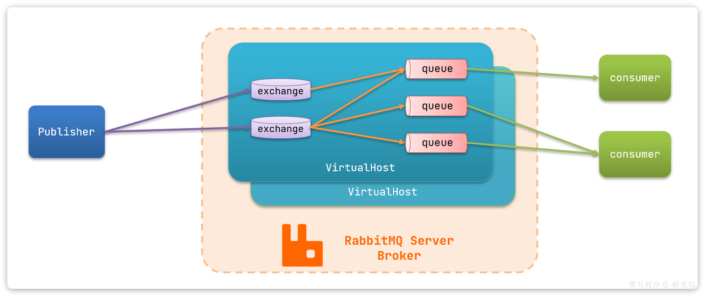

<!-- more -->

# 安装及启用
```shell
docker pull rabbitmq:3-management
```
```shell
docker run \
 -e RABBITMQ_DEFAULT_USER=xxxx \
 -e RABBITMQ_DEFAULT_PASS=xxxx \
 -v mq-plugins:/plugins \
 --name mq \
 --hostname mq \
 --restart=always \
 -p 15672:15672 \
 -p 5672:5672 \
 -d \
 rabbitmq:3-management
```
5672：MQ的通信端口
15672：管控台的端口

# 同步调用与异步调用
## 同步调用
每一步调用者必须等待被调用方完全执行完毕并返回结果之后才能继续执行后续代码

### 优缺点
- 优点:
  - 简单直观,代码易于理解和编写
  - 易于调试,由于执行顺序明确,调试起来相对容易
  - 对实时性要求较高的场景较好
- 缺点:
  - 阻塞执行,如果一个操作需要很长时间来完成,那么整个程序会被阻塞,不能执行其他任务
  - 资源浪费,在等待长时间操作完成时,CPU和其他资源可能会处于空闲状态 
  - 级联失败问题,下游出错,上游也会出错
  - 耦合度高,服务间直接调用
  - 响应时长为几个服务处理时长的总和,性能和吞吐能力下降

## 异步调用
调用者发出调用后无需等待被调用方完成就可以继续执行其他任务

### 优缺点
- 优点:
  - 提高效率,异步调用可以使得程序在等待某些耗时操作完成的同时执行其他任务,提高了整体的执行效率
  - 资源利用率高,在等待耗时操作时,可以释放资源给其他任务使用,避免了资源浪费
  - 更好的用户体验,在网络应用中,用户不必等待页面加载完成就能进行其他操作,提高了用户体验
  - 需要处理耗时操作的场景较好
  - 耦合度低,只与Broker耦合
  - 高并发的请求由Broker承受,流量削峰,不会打到具体的服务
- 缺点:
  - 复杂性增加,异步编程通常比同步编程更复杂,因为它涉及更多的控制结构和错误处理逻辑
  - 调试困难,由于执行路径不是线性的,调试起来相对困难

## 例子
打电话预约服务
- `同步调用`:
  - 预约餐桌
  - 您稍等,我确认下是否可以预约
  - (五分钟后)您的预约已确认,请在指定时间到店
  - 挂断
- `异步调用`:
  - 预约餐桌
  - 好的,稍后我会短信通知您
  - 挂断

# 主流MQ中间件
- RabbitMQ
- ActiveMQ
- Kafka
- RocketMQ
- 等

## 对比
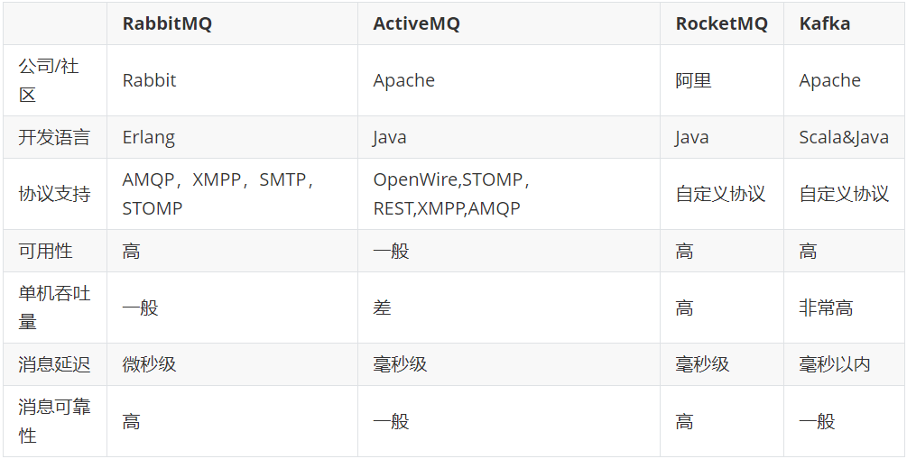

## 选择
- 选择MQ中间件时,需要根据业务场景和需求进行选择
- 业务场景:
  - 实时性要求高:RabbitMQ
  - 消息可靠性要求高:ActiveMQ
  - 消息量要求高:Kafka
  - 消息低延迟要求高:RocketMQ
- 需求:
  - 功能完善:RabbitMQ、ActiveMQ、Kafka、RocketMQ
  - 性能好:RabbitMQ、Kafka、RocketMQ
  - 成本低:RabbitMQ、ActiveMQ、Kafka、RocketMQ
- 最终: 公司用什么，我们用什么

# RabbitMQ的组件角色
 - `Publisher 生产者`: 生产消息的应用
 - `Consumer 消费者`: 消费消息的应用
 - `Queue 队列`: 消息的缓冲区
 - `Exchange 交换机`: 接收生产者发送的消息,根据路由键将消息路由到一个或多个队列
 - `Binding 绑定`: 交换机和队列之间的关联关系,定义了路由规则
 - `Routing Key 路由键`: 交换机根据路由键将消息路由到指定的队列
 - `Virtual Host 虚拟主机`: 用于逻辑上隔离不同的消息队列,每个虚拟主机都有自己的交换机、队列和绑定关系

# 消息收发
## 实现步骤
(以下实现了解为主,AMQP的RabbitTemplate工具不需要编写这么复杂的逻辑)
- 创建连接工厂
- 获取连接
- 创建通道
- 声明队列
- (Publisher)发送消息,关闭通道和连接
- (Consumer)异步订阅消息

## Publisher生产消息
```java
@Test
public void sendMessageTest() throws Exception {
    // 创建连接工厂
    ConnectionFactory factory = new ConnectionFactory();
    factory.setHost("localhost");
    factory.setPort(5672);
    factory.setUsername("guest");
    factory.setPassword("guest");
    factory.setVirtualHost("/");
    // 获取连接
    Connection connection = factory.newConnection();
    // 创建通道
    Channel channel = connection.createChannel();
    // 声明队列
    channel.queueDeclare("queue1", false, false, false, null);
    // 发送消息
    String message = "Hello, RabbitMQ!";
    channel.basicPublish("", "queue1", null, message.getBytes());
    // 关闭通道和连接
    channel.close();
    connection.close();
}
```

## Consumer消费消息
```java
@Test
public void doMessageTest() throws Exception {
    // 创建连接工厂
    ConnectionFactory factory = new ConnectionFactory();
    factory.setHost("localhost");
    factory.setPort(5672);
    factory.setUsername("guest");
    factory.setPassword("guest");
    factory.setVirtualHost("/");
    // 获取连接
    Connection connection = factory.newConnection();
    // 创建通道
    Channel channel = connection.createChannel();
    // 声明队列
    channel.queueDeclare("queue1", false, false, false, null);
    // 异步订阅消息
    channel.basicConsume("queue1", true, new DefaultConsumer(channel) {
        /**
         * 消息处理
         * @param consumerTag 消费者标签
         * @param envelope 信封
         * @param properties 属性
         * @param body 消息体
         * @throws IOException
         */
        @Override
        public void handleDelivery(String consumerTag, Envelope envelope, AMQP.BasicProperties properties, byte[] body) throws IOException {
            String message = new String(body, "UTF-8");
            System.out.println("Received message: " + message);
        }
    });
}
```

# SpringAMQP
SpringBoot整合RabbitMQ的模板,相当于一个起步依赖
https://spring.io/projects/spring-amqp#SpringAMQP官网

## 核心功能
- RabbitTemplate: 用于发送和接收消息的核心类
- 自动声明队列、交换机及绑定关系
- 基于注解的监听器模式,异步接收消息

## 五种模式
### Simple
简单模式,一个生产者,一个消费者,一个队列
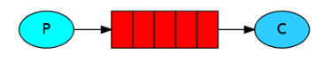

### Work Queues
工作队列模式,一个生产者,多个消费者,一个队列
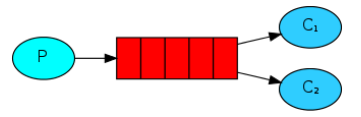
多个消费者之间是竞争关系

### Fanout
广播模式,一个生产者,多个消费者,多个队列,消息发送到所有队列
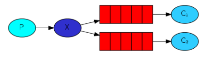
通过交换机,把消息路由到队列,实现群发

### Direct
直接模式,一个生产者,多个消费者,多个队列,根据路由键路由到指定队列
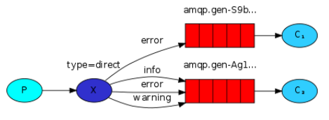
与Fanout类似,但通过交换机,通过路由key的精确名称把消息路由到队列,实现群发

### Topics
主题模式,一个生产者,多个消费者,多个队列,根据路由键路由到指定队列,支持通配符
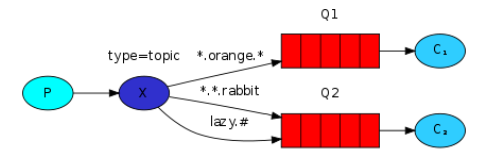
与Direct类似,但通过交换机,通过路由key的`部分名称`把消息路由到队列,利用通配符识别

## 消息转换器
消息转换器用于在Java对象和消息之间进行转换,常用的有:
- `SimpleMessageConverter`: 默认的消息转换器,支持基本类型和字符串
- `Jackson2JsonMessageConverter`: 基于Jackson库的消息转换器,支持将Java对象转换为JSON格式的消息

### 默认消息转换器
默认的消息转换器,JDK序列化器,只能发送字符串和基本类型
```java
@Test
public void testSendMap() throws InterruptedException {
    // 准备消息
    Map<String,Object> msg = new HashMap<>();
    msg.put("name", "Jack");
    msg.put("age", 21);
    // 发送消息
    rabbitTemplate.convertAndSend("simple.queue","", msg);
}
```

### JSON消息转换器
配置JSON消息转换器
```xml
<dependency>
    <groupId>com.fasterxml.jackson.dataformat</groupId>
    <artifactId>jackson-dataformat-xml</artifactId>
    <version>2.9.5</version>
</dependency>
```
```java
@Bean
public MessageConverter jsonMessageConverter(){
    return new Jackson2JsonMessageConverter();
}
```

# `消息可靠性`
## 消息丢失的可能性
- 消息未到达交换机
- 消息未正确路由到队列
- MQ宕机,消息丢失
- 消费者接收消息,消费前宕机,消息丢失

## 确保消息不丢失的机制
### 生产者确认机制
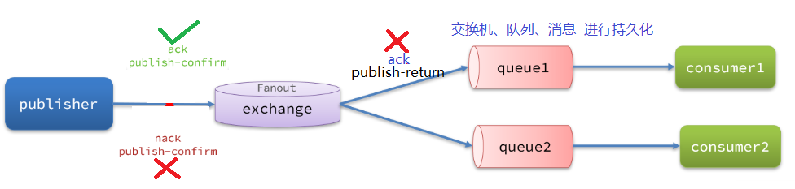
配置文件
```xml
spring:
  rabbitmq:
    publisher-confirm-type: correlated
    publisher-returns: true
    template:
      mandatory: true
```
- `publish-confirm-type`：开启publisher-confirm
  - `correlated`: 异步回调,定义ConfirmCallback,MQ返回结果时会回调这个ConfirmCallback
  - `simple`: 同步等待confirm结果,直到超时
- `publisher-returns`：开启publisher-returns
  - `true`: 开启publisher-returns,同样是基于callback机制,不过是定义ReturnCallback
  - `false`: 不开启publisher-returns
- `template.mandatory`：开启mandatory
  - `true`: 调用ReturnCallback
  - `false`: 直接丢弃消息

发送消息时指定ConfirmCallback
```java
public void testSendMessage2SimpleQueue() throws InterruptedException {
    // 1.消息体
    String message = "hello, spring amqp!";
    // 2.全局唯一的消息ID，需要封装到CorrelationData中
    CorrelationData correlationData = new CorrelationData(UUID.randomUUID().toString());
    // 3.添加callback
    correlationData.getFuture().addCallback(
        result -> {
            if(result.isAck()){
                // 3.1.ack，消息成功
                log.debug("消息发送成功, ID:{}", correlationData.getId());
            }else{
                // 3.2.nack，消息失败
                log.error("消息发送失败, ID:{}, 原因{}",correlationData.getId(), result.getReason());
            }
        },
        ex -> log.error("消息发送异常, ID:{}, 原因{}",correlationData.getId(),ex.getMessage())
    );
    // 4.发送消息
    rabbitTemplate.convertAndSend("", "simple.queue", message, correlationData);

    // 休眠一会儿，等待ack回执
    Thread.sleep(2000);
}
```

定义Return回调,每个RabbitTemplate只能配置一个ReturnCallback,因此需要在项目加载时配置
```java
@Slf4j
@Configuration
public class CommonConfig implements ApplicationContextAware {
    @Override
    public void setApplicationContext(ApplicationContext applicationContext) throws BeansException {
        // 获取RabbitTemplate
        RabbitTemplate rabbitTemplate = applicationContext.getBean(RabbitTemplate.class);
        // 设置ReturnCallback
        rabbitTemplate.setReturnCallback((message, replyCode, replyText, exchange, routingKey) -> {
            // 投递失败，记录日志
            log.info("消息发送失败，应答码{}，原因{}，交换机{}，路由键{},消息{}",
                     replyCode, replyText, exchange, routingKey, message.toString());
            // 如果有业务需要，可以重发消息
        });
    }
}
```
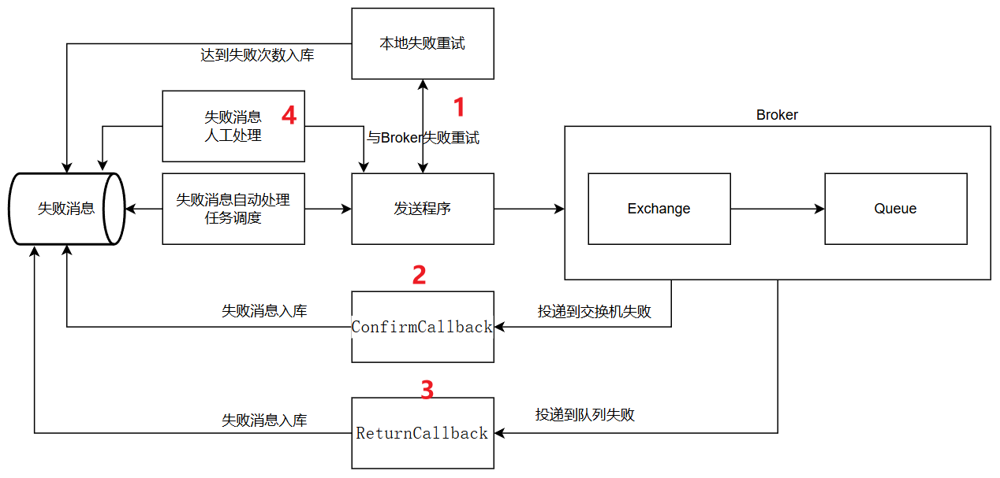

### 持久化机制
durable默认就是true,交换机和队列默认都是持久化的
- 交换机持久化
- 队列持久化
- 消息持久化:在发送消息时，使用Message对象，并设置delivery-mode为持久化
```java
MessageProperties messageProperties = new MessageProperties();
messageProperties.setDeliveryMode(MessageDeliveryMode.PERSISTENT);
Message message = new Message("hello, rabbitmq!".getBytes(StandardCharsets.UTF_8), messageProperties);
```

### 消费者ack机制
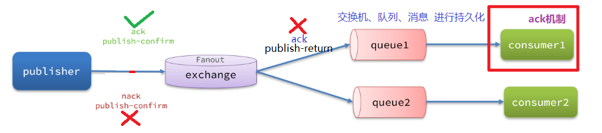
ack取值(默认auto):
- `auto`: 自动ack,消息被消费后,自动返回ack
- `manual`: 手动ack,消费成功与否返回ack或`nack(让消息返回队列)`
- `none`: 消费者收到消息直接返回ack给MQ,然后MQ直接删除消息,`消息可能会丢失`
```xml
spring:
  rabbitmq:
    listener:
      simple:
        acknowledge-mode: manual
```
```java
@RabbitListener(queues = "ack.queue")
public void listenAckQueue(Message message, Channel channel) throws IOException {
    try {
        log.info("消费者1,收到消息:{}", new String(message.getBody()));
        // 手动ack
        channel.basicAck(message.getMessageProperties().getDeliveryTag(), false);
    } catch (Exception e) {
        // 手动nack
        channel.basicNack(message.getMessageProperties().getDeliveryTag(), false, true);
    }
}
```

auto的本地重试配置
```xml
spring:
    rabbitmq:
        listener:
        simple:
            retry:
                enabled: true # 开启本地重试
                initial-interval: 1000 # 初始的失败等待时长为1秒
                max-attempts: 3 # 最大重试次数
                multiplier: 2.0 # 失败的等待时长倍数，下次等待时长 = multiplier * last-interval
                stateless: true # true无状态；false有状态。如果业务中包含事务，这里改为false
```

失败策略:
- `RejectAndDontRequeueRecoverer`：重试耗尽后，直接reject，丢弃消息。默认就是这种方式
- `ImmediateRequeueMessageRecoverer`：重试耗尽后，立即重新入队
- `TransactionRecoverer`：事务消息，失败后回滚事务
- `RepublishMessageRecoverer`：重试耗尽后，将消息重新发布到指定的交换机

RepublishMessageRecoverer机制
定义错误交换机、队列和绑定关系
```java
@Configuration
public class ErrorMsgConfig {
    @Bean
    public DirectExchange errorExchange() {
        return new DirectExchange("error.exchange");
    }

    @Bean
    public Queue errorQueue() {
        return new Queue("error.queue");
    }

    @Bean
    public Binding errorBinding() {
        return BindingBuilder.bind(errorQueue()).to(errorExchange()).with("error");
    }

    @Bean
    public RepublishMessageRecoverer republishMessageRecoverer(RabbitTemplate rabbitTemplate) {
        return new RepublishMessageRecoverer(rabbitTemplate, "error.exchange", "error");
    }
}
```

监听错误队列
```java
@RabbitListener(queues = "error.queue")
public void listenErrorQueue(Message message) {
    log.error("收到错误队列的消息:{}", new String(message.getBody()));
}
```

# 消息重复消费问题
## 问题描述
消息重复消费是指同一条消息被消费者多次处理,可能导致数据不一致的问题,例如:
- 数据库重复插入
- 重复发送邮件
- 重复更新缓存

## 问题原因
本质是看消费的操作是否是幂等的
- 消费者ack机制:如果消费者在处理消息时发生异常,没有返回ack,消息会被重新入队,导致重复消费
- 消费者重试机制:如果消费者在处理消息时发生异常,会触发重试机制,导致重复消费

## 解决办法
利用数据库唯一约束和Redis
### 方案一
生产者发送消息时携带唯一ID,消费者在处理消息前,先去Redis判断消息是否已经被处理,如果已经被处理,则直接丢弃消息

### 方案二
生产者发送消息时携带唯一ID,消费者将ID用incr命令自增,如果返回值为1,则说明是第一次处理,如果返回值为0,则说明是重复处理

# 消息顺序消费
## 问题描述
多个消费者消费同一个队列,如何保证消息顺序消费

## 方案一
消费者指定线程消费数为1
```java
@RabbitListener(queues = "order.queue", concurrency = "1")
```
## 方案二
MQ增加队列属性x-single-active-consumer为true
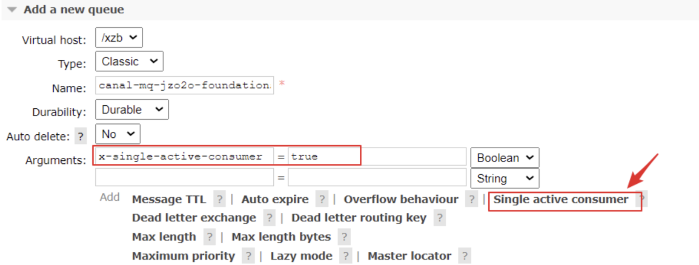

# 消息积压问题
## 问题原因
生产者生产消息的速度远高于消费者消费消息的速度

## 原因分析
- `设计问题`:生产者与消费者数量不匹配,重新设计
- `消费者出异常`:解决消费者代码
- `消费者宕机`:第一步：修复宕机的情况,第二步：临时开启多个消费者，来以倍速消费积压的消息。当积压的消息消费的差不多的情况，关闭临时消费者

## 采用惰性队列
惰性队列是指消息在内存中存储,当内存满时,将消息写入磁盘,以减少内存使用

# 死信交换机
## 产生情况
- 消费者使用basic.reject 或 basic.nack 声明消费失败，并且消息的requeue参数设置为false
- 消息设置了过期时间，或者消息存放的队列设置了过期时间，超过时间无人消费
- 要投递的队列消息满了，无法投递
这类消息为`死信`,传递给特定交换机,该交换机为`死信交换机`