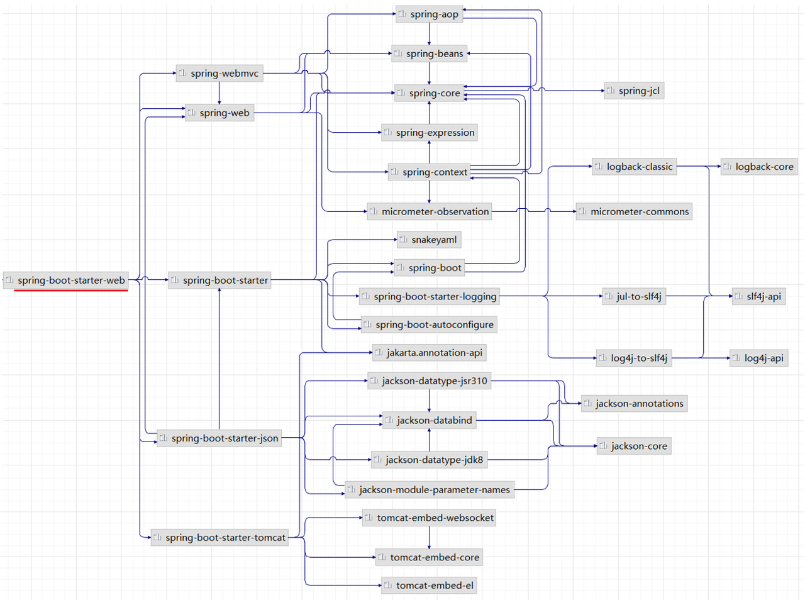
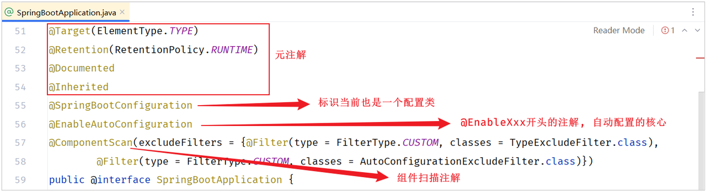
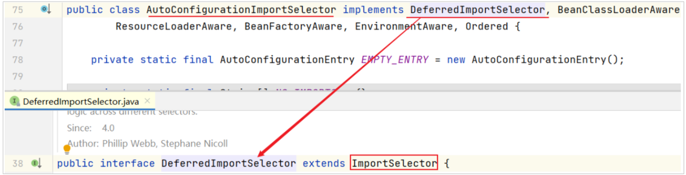
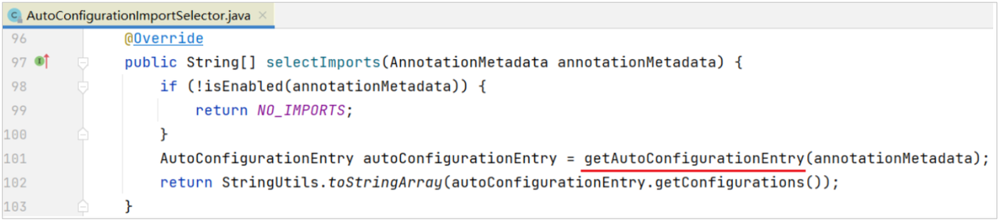
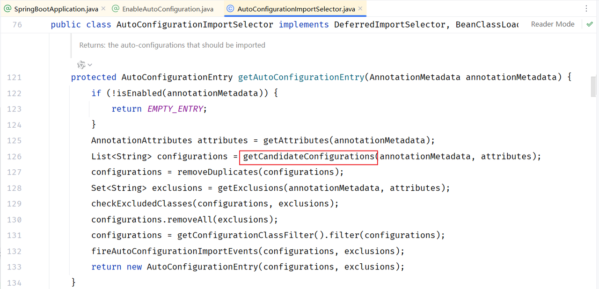
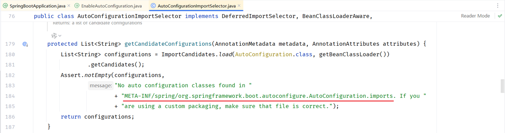

springboot原理篇，主要偏向于底层原理
- 配置优先级
- Bean管理
- Springboot的底层原理

<!-- more -->

# 配置优先级
SpringBoot项目当中支持三类配置文件:
- application.properties
- application.yml
- application.yaml
优先级也是自高到底的顺序.(其中yml是主流配置文件,不推荐同时使用多种格式的配置文件)
除了配置文件以外,SpringBoot还支持Java属性配置(-Dkey=value)和命令行参数(--key=value)
```yaml
-Dserver.port=9000
```
```yaml
--server.port=10010
```
五种配置方式的优先级:命令行参数 >  系统属性参数 > properties参数 > yml参数 > yaml参数

# Bean管理
可以通过Spring当中提供的注解@Component以及它的三个衍生注解(@Controller、@Service、@Repository)来声明IOC容器中的bean对象.
及通过@Autowired注解来实现依赖注入DI.
以下设计两方面:
- bean的作用域配置
- 管理第三方的bean对象

## Bean的作用域
IOC容器当中,默认bean对象是单例的(只有一个实例对象)
|作用域|说明|
|---|---|
|singleton|容器内同名称的bean只有一个实例(单例)(默认)|
|prototype|每次使用该bean时会创建新的实例(非单例)|
|request|每个请求范围内会创建新的实例(web环境中)|
|session|每个会话范围内会创建新的实例(web环境中)|
|application|每个应用范围内会创建新的实例(web环境中)|
通过@Scope注解配置作用域,可以使用@Lazy注解来延迟初始化到第一次使用时.

## 第三方Bean
引入第三方依赖提供的类无法使用@Component及其衍生注解来声明Bean,此时需使用@Bean注解来声明bean.
例子 在启动类中直接声明这个Bean
```java
import com.itheima.utils.AliyunOSSOperator;
import com.itheima.utils.AliyunOSSProperties;
import org.springframework.boot.SpringApplication;
import org.springframework.boot.autoconfigure.SpringBootApplication;
import org.springframework.boot.web.servlet.ServletComponentScan;
import org.springframework.context.annotation.Bean;
import org.springframework.scheduling.annotation.EnableScheduling;

@ServletComponentScan
@EnableScheduling
@SpringBootApplication
public class TliasWebManagementApplication {

    public static void main(String[] args) {
        SpringApplication.run(TliasWebManagementApplication.class, args);
    }

    @Bean
    public AliyunOSSOperator aliyunOSSOperator(AliyunOSSProperties ossProperties) {
        return new AliyunOSSOperator(ossProperties);
    }
}
```

例子 通过 @Configuration 注解声明一个配置类
```java
package com.itheima.config;

import com.itheima.utils.AliyunOSSOperator;
import com.itheima.utils.AliyunOSSProperties;
import org.springframework.context.annotation.Bean;
import org.springframework.context.annotation.Configuration;

@Configuration
public class OSSConfig {
    @Bean
    public AliyunOSSOperator aliyunOSSOperator(AliyunOSSProperties ossProperties) {
        return new AliyunOSSOperator(ossProperties);
    }
}
```

# SpringBoot原理
学习SpringBoot的原理就是来解析SpringBoot当中的起步依赖与自动配置的原理

## 起步依赖
引入了 spring-boot-starter-web 之后,maven会通过依赖传递特性,将web开发所需的常见依赖都传递下来.(springboot-starter-web集成了web开发中常见的依赖:json、web、webmvc、tomcat等)

所以,起步依赖的原理就是Maven的依赖传递.

## 自动配置
SpringBoot的自动配置就是当spring容器启动后,一些配置类、bean对象就自动存入到了IOC容器中,不需要我们手动去声明,从而简化了开发,省去了繁琐的配置操作

### 实现方案
导入com.example依赖却无法@Autowired注入,是因为SpringBoot项目中的@SpringBootApplication注解,虽然具有包扫描的作用,但是它只会扫描启动类所在的当前包以及子包,而当前包是com.it

#### 方案1 @ComponentScan 组件扫描
```java
@SpringBootApplication
@ComponentScan({"com.itheima","com.example"}) //指定要扫描的包
public class SpringbootWebConfigApplication {
    public static void main(String[] args) {
        SpringApplication.run(SpringbootWebConfigApplication.class, args);
    }
}
```
当需要引入大量的第三方的依赖,就需要在启动类上配置N多要扫描的包,这种方式会很繁琐,而且这种大面积的扫描性能也比较低.

#### 方案2 @Import导入
##### @Import导入普通类
```java
@Import(TokenParser.class) //导入的类会被Spring加载到IOC容器中
@SpringBootApplication
public class SpringbootWebConfigApplication {
    public static void main(String[] args) {
        SpringApplication.run(SpringbootWebConfigApplication.class, args);
    }
}
```

##### @Import导入配置类
配置类
```java
@Configuration
public class HeaderConfig {
    @Bean
    public HeaderParser headerParser(){
        return new HeaderParser();
    }

    @Bean
    public HeaderGenerator headerGenerator(){
        return new HeaderGenerator();
    }
}
```
启动类
```java
@Import(HeaderConfig.class) //导入配置类
@SpringBootApplication
public class SpringbootWebConfig2Application {
    public static void main(String[] args) {
        SpringApplication.run(SpringbootWebConfig2Application.class, args);
    }
}
```

##### @Import导入ImportSelector接口实现类
实现类
```java
public class MyImportSelector implements ImportSelector {
    public String[] selectImports(AnnotationMetadata importingClassMetadata) {
        //返回值字符串数组（数组中封装了全限定名称的类）
        return new String[]{"com.example.HeaderConfig"};
    }
}
```
启动类
```java
@Import(MyImportSelector.class) //导入ImportSelector接口实现类
@SpringBootApplication
public class SpringbootWebConfig2Application {
    public static void main(String[] args) {
        SpringApplication.run(SpringbootWebConfig2Application.class, args);
    }
}
```
##### 第三方依赖自己指定bean对象和配置类提供的@EnableXxxxx注解
比较常见的方案就是第三方依赖给我们提供一个注解,这个注解一般都以@EnableXxxx开头的注解,注解中封装的就是@Import注解.
第三方依赖提供的注解
```java
@Retention(RetentionPolicy.RUNTIME)
@Target(ElementType.TYPE)
@Import(MyImportSelector.class)//指定要导入哪些bean对象或配置类
public @interface EnableHeaderConfig { 
}
```
启动类
```java
@EnableHeaderConfig  //使用第三方依赖提供的Enable开头的注解
@SpringBootApplication
public class SpringbootWebConfig2Application {
    public static void main(String[] args) {
        SpringApplication.run(SpringbootWebConfig2Application.class, args);
    }
}
```

### 原理分析
#### 源码跟踪
根据SpringBoot的自动配置原理,要从SpringBoot启动类上使用的核心注解@SpringBootApplication开始分析

@Configuration表明SpringBoot启动类就是一个配置类
@Indexed用来加速应用启动的(不用关心)
@ComponentScan注解是用来扫描启动类所在的包及其子包下所有被@Component及其衍生注解声明的类
@Import注解导入了实现ImportSelector接口的实现类AutoConfigurationImportSelector类(ImportSelector接口的实现类),AutoConfigurationImportSelector类中重写了ImportSelector接口的selectImports()方法

selectImports()方法底层调用getAutoConfigurationEntry()方法，获取可自动配置的配置类信息集合

getAutoConfigurationEntry()方法通过调用getCandidateConfigurations(annotationMetadata, attributes)方法获取在配置文件中配置的所有自动配置类的集合

getCandidateConfigurations方法的功能：
获取所有基于 META-INF/spring/org.springframework.boot.autoconfigure.AutoConfiguration.imports文件中配置类的集合(配置类中定义了@Bean注解标识的方法)


自动配置的原理就是在配置类中定义一个@Bean标识的方法,而Spring会自动调用配置类中使用@Bean标识的方法,并把方法的返回值注册到IOC容器中.
当SpringBoot程序启动时,就会加载配置文件当中所定义的配置类,并将这些配置类信息(类的全限定名)封装到String类型的数组中,最终通过@Import注解将这些配置类全部加载到Spring的IOC容器中,交给IOC容器管理.

#### @Conditional