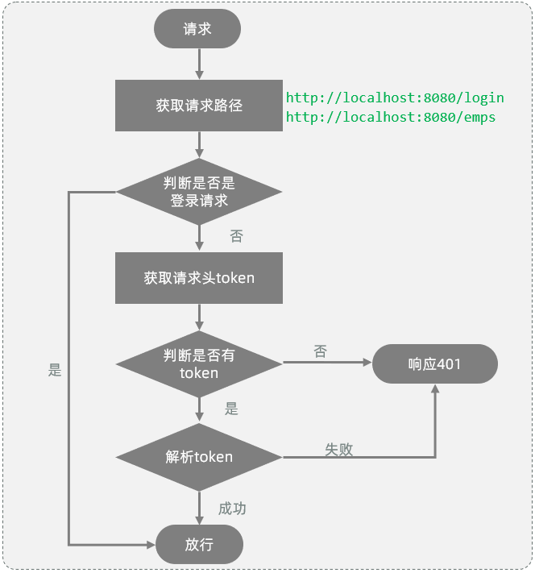
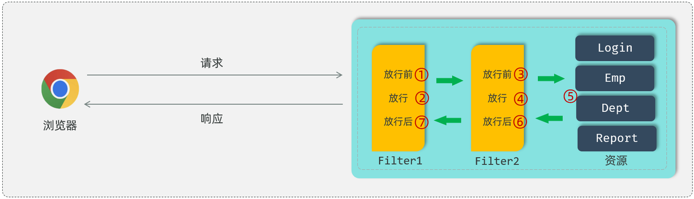

统一拦截技术有两种,Filter过滤器和Interceptor拦截器,用于统一拦截到所有的请求校验令牌的有效性.两种只需要实现一种即可.

<!-- more -->
# Filter过滤器
Filter表示过滤器,是 JavaWeb三大组件(Servlet、Filter、Listener)之一,可以把对资源的请求拦截下来,从而实现一些特殊的功能,比如完成一些通用的操作:登录校验、统一编码处理、敏感字符处理等.
## 基本使用操作
- 第1步,定义过滤器:定义一个类,实现 Filter 接口,并重写其所有方法.
- 第2步,配置过滤器:Filter类上加 @WebFilter 注解,配置拦截资源的路径.引导类上加 @ServletComponentScan 开启Servlet组件支持.

### 定义过滤器
```java
public class DemoFilter implements Filter {
    //初始化方法, web服务器启动, 创建Filter实例时调用, 只调用一次
    public void init(FilterConfig filterConfig) throws ServletException {
        System.out.println("init ...");
    }

    //拦截到请求时,调用该方法,可以调用多次
    public void doFilter(ServletRequest servletRequest, ServletResponse servletResponse, FilterChain chain) throws IOException, ServletException {
        System.out.println("拦截到了请求...");
    }

    //销毁方法, web服务器关闭时调用, 只调用一次
    public void destroy() {
        System.out.println("destroy ... ");
    }
}
```

### 配置过滤器
Filter的配置需要在Filter类上添加一个注解：@WebFilter,并指定属性urlPatterns,通过这个属性指定过滤器要拦截哪些请求
```java
@WebFilter(urlPatterns = "/*") //配置过滤器要拦截的请求路径（ /* 表示拦截浏览器的所有请求 ）
public class DemoFilter implements Filter {
    //初始化方法, web服务器启动, 创建Filter实例时调用, 只调用一次
    public void init(FilterConfig filterConfig) throws ServletException {
        System.out.println("init ...");
    }

    //拦截到请求时,调用该方法,可以调用多次
    public void doFilter(ServletRequest servletRequest, ServletResponse servletResponse, FilterChain chain) throws IOException, ServletException {
        System.out.println("拦截到了请求...");
    }

    //销毁方法, web服务器关闭时调用, 只调用一次
    public void destroy() {
        System.out.println("destroy ... ");
    }
}
```
在Filter类上面加了@WebFilter注解之后,接下来我们还需要在启动类上面加上一个注解@ServletComponentScan,通过这个@ServletComponentScan注解来开启SpringBoot项目对于Servlet组件的支持.
```java
@ServletComponentScan //开启对Servlet组件的支持
@SpringBootApplication
public class TliasManagementApplication {
    public static void main(String[] args) {
        SpringApplication.run(TliasManagementApplication.class, args);
    }
}
```
## 登录校验
1. 获取请求url
2. 判断请求url中是否包含login,如果包含,说明是登录操作,放行
3. 获取请求头中的令牌（token）
4. 判断令牌是否存在,如果不存在,响应 401
5. 解析token,如果解析失败,响应 401
6. 放行

```java
package com.itheima.filter;

import com.itheima.utils.JwtUtils;
import jakarta.servlet.*;
import jakarta.servlet.annotation.WebFilter;
import jakarta.servlet.http.HttpServletRequest;
import jakarta.servlet.http.HttpServletResponse;
import lombok.extern.slf4j.Slf4j;
import org.apache.http.HttpStatus;
import org.springframework.util.StringUtils;
import java.io.IOException;

/**
 * 令牌校验过滤器
 */
@Slf4j
@WebFilter(urlPatterns = "/*")
public class TokenFilter implements Filter {

    @Override
    public void doFilter(ServletRequest req, ServletResponse resp, FilterChain chain) throws IOException, ServletException {
        HttpServletRequest request = (HttpServletRequest) req;
        HttpServletResponse response = (HttpServletResponse) resp;
        //1. 获取请求url。
        String url = request.getRequestURL().toString();

        //2. 判断请求url中是否包含login，如果包含，说明是登录操作，放行。
        if(url.contains("login")){ //登录请求
            log.info("登录请求 , 直接放行");
            chain.doFilter(request, response);
            return;
        }

        //3. 获取请求头中的令牌（token）。
        String jwt = request.getHeader("token");

        //4. 判断令牌是否存在，如果不存在，返回错误结果（未登录）。
        if(!StringUtils.hasLength(jwt)){ //jwt为空
            log.info("获取到jwt令牌为空, 返回错误结果");
            response.setStatus(HttpStatus.SC_UNAUTHORIZED);
            return;
        }

        //5. 解析token，如果解析失败，返回错误结果（未登录）。
        try {
            JwtUtils.parseJWT(jwt);
        } catch (Exception e) {
            e.printStackTrace();
            log.info("解析令牌失败, 返回错误结果");
            response.setStatus(HttpStatus.SC_UNAUTHORIZED);
            return;
        }

        //6. 放行。
        log.info("令牌合法, 放行");
        chain.doFilter(request , response);
    }

}
```
## 执行流程
单个Filter会再初始化执行init(),放行执行doFilter(),销毁执行destroy()
多个Filter按照过滤器类名（字符串）的自然排序执行


# Interceptor拦截器
拦截器是一种动态拦截方法调用的机制,类似于过滤器,是Spring框架中提供的,用来动态拦截控制器方法的执行

## 基本使用操作
- 1. 定义拦截器
- 2. 注册配置拦截器

### 定义拦截器
实现HandlerInterceptor接口,并重写其所有方法
```java
//自定义拦截器
@Component
public class DemoInterceptor implements HandlerInterceptor {
    //目标资源方法执行前执行。 返回true：放行    返回false：不放行
    @Override
    public boolean preHandle(HttpServletRequest request, HttpServletResponse response, Object handler) throws Exception {
        System.out.println("preHandle .... ");
        
        return true; //true表示放行
    }

    //目标资源方法执行后执行
    @Override
    public void postHandle(HttpServletRequest request, HttpServletResponse response, Object handler, ModelAndView modelAndView) throws Exception {
        System.out.println("postHandle ... ");
    }

    //视图渲染完毕后执行，最后执行
    @Override
    public void afterCompletion(HttpServletRequest request, HttpServletResponse response, Object handler, Exception ex) throws Exception {
        System.out.println("afterCompletion .... ");
    }
}
```

### 注册配置拦截器
创建一个配置类 WebConfig,实现WebMvcConfigurer接口,并重写addInterceptors方法
```java
@Configuration  
public class WebConfig implements WebMvcConfigurer {

    //自定义的拦截器对象
    @Autowired
    private DemoInterceptor demoInterceptor;

    
    @Override
    public void addInterceptors(InterceptorRegistry registry) {
       //注册自定义拦截器对象
        registry.addInterceptor(demoInterceptor).addPathPatterns("/**");//设置拦截器拦截的请求路径（ /** 表示拦截所有请求）
    }
}
```

## 登录校验
和登录校验Filter过滤器当中的逻辑完全一致
```java
@Slf4j
@Component
public class TokenInterceptor implements HandlerInterceptor {
    @Override
    public boolean preHandle(HttpServletRequest request, HttpServletResponse response, Object handler) throws Exception {
        //1. 获取请求url。
        String url = request.getRequestURL().toString();

        //2. 判断请求url中是否包含login，如果包含，说明是登录操作，放行。
        if(url.contains("login")){ //登录请求
            log.info("登录请求 , 直接放行");
            return true;
        }

        //3. 获取请求头中的令牌（token）。
        String jwt = request.getHeader("token");

        //4. 判断令牌是否存在，如果不存在，返回错误结果（未登录）。
        if(!StringUtils.hasLength(jwt)){ //jwt为空
            log.info("获取到jwt令牌为空, 返回错误结果");
            response.setStatus(HttpStatus.SC_UNAUTHORIZED);
            return false;
        }

        //5. 解析token，如果解析失败，返回错误结果（未登录）。
        try {
            JwtUtils.parseJWT(jwt);
        } catch (Exception e) {
            e.printStackTrace();
            log.info("解析令牌失败, 返回错误结果");
            response.setStatus(HttpStatus.SC_UNAUTHORIZED);
            return false;
        }

        //6. 放行。
        log.info("令牌合法, 放行");
        return true;
    }

}
```

```java
@Configuration  
public class WebConfig implements WebMvcConfigurer {
    //拦截器对象
    @Autowired
    private TokenInterceptor tokenInterceptor;

    @Override
    public void addInterceptors(InterceptorRegistry registry) {
       //注册自定义拦截器对象
        registry.addInterceptor(tokenInterceptor).addPathPatterns("/**");
    }
}
```

## 拦截器的使用细节
- 拦截器的拦截路径配置
- 拦截器的执行流程

### 2.5.4 拦截路径
通过addPathPatterns("要拦截路径")方法,就可以指定要拦截哪些资源.
还可以指定不拦截哪些资源,只需要调用excludePathPatterns("不拦截路径")方法
```java
@Configuration  
public class WebConfig implements WebMvcConfigurer {

    //拦截器对象
    @Autowired
    private DemoInterceptor demoInterceptor;

    @Override
    public void addInterceptors(InterceptorRegistry registry) {
        //注册自定义拦截器对象
        registry.addInterceptor(demoInterceptor)
                .addPathPatterns("/**")//设置拦截器拦截的请求路径（ /** 表示拦截所有请求）
                .excludePathPatterns("/login");//设置不拦截的请求路径
    }
}
```
|拦截路径|含义|举例|
|---|---|---|
|/*|一级路径|能匹配/depts，/emps，/login，不能匹配 /depts/1|
|/**|任意级路径|能匹配/depts，/depts/1，/depts/1/2|
|/depts/*|/depts下的一级路径|能匹配/depts/1，不能匹配/depts/1/2，/depts|
|/depts/**|/depts下的任意级路径|能匹配/depts，/depts/1，/depts/1/2，不能匹配/emps/1|

### 执行流程
定义了拦截器后,会在执行Controller的方法之前,请求被拦截器拦截住.执行preHandle()方法,这个方法执行完成后需要返回一个布尔类型的值,如果返回true,就表示放行本次操作,才会继续访问controller中的方法;如果返回false,则不会放行(controller中的方法也不会执行).


# 过滤器和拦截器之间的区别
- 接口规范不同:过滤器需要实现Filter接口,而拦截器需要实现HandlerInterceptor接口.
- 拦截范围不同:过滤器Filter会拦截所有的资源,而Interceptor只会拦截Spring环境中的资源.